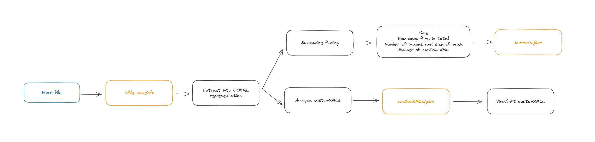

# OOXML Manipulator

## Summary

**Author**: Duc Phan

**Description**

A program that extracts a Word file into its [OOXML](https://en.wikipedia.org/wiki/Office_Open_XML) representation and also provides some utils

The major features of this program include

- extract a Word file into a new folder containing its OOXML representation
- summarize the structure: how many files, how many images, how many custom XML, etc
- re-zip into the original Word file after the user has modified the file
- allow adding/editing custom XMLs via a primitive GUI

**Stretched goals**: might not be included to ensure I meet the deadline

- watch for the OOXML changes to update the actual Word file live
- validate OOXML structure

The extraction is inspired by this [VSCode Extension](https://marketplace.visualstudio.com/items?itemName=yuenm18.ooxml-viewer)

## Motivation

I work with Word files daily where we inject content from different sources into Word files.
One of the pain points is the lack of tools to explore and edit the internal structure of those file to understand the output better as well as well as fixing bugs that are not visible through the Word UI.

So this project is going to be the starting point for the tools that will be used in my work.

## Context

This section explains the individual features for more info

### User flow

### Feature explanation

**1. Word file extraction and rezip**

A Word file is a zipped representation of different file types behind the scenes. It includes

- the main OOXML in `document.xml` representing the actual UI shown
- relationship files indicating the structural relationship between each UI element in Word
- images
- custom metadata (`customXML`) made by the users (most likely coders) programmatically (found via `item1.xml`, `itemProps1.xml`, `item2.xml`, etc)
- etc

This feature helps unzip the Word file into its mentioned internal structure and also re-zip it

**2. Summarize the structure**

This will analyze and summarize the file info, including

- basic file info: name, size, number of entries, other metadata
- image count, size of each, etc
- number of custom XMLs

Note that this will extract the Word file if it's not found

The result will be stored in `summary.json`

**3. Analyze and update customXML**

Analyze the `item*.xml` files to get the list of custom XML embedded in the Word file. The result will be stored in `customXml.json`.

We'll also support saving the `customXML` back to the actual xml file

**4. Watch fo file changes**

The main purpose is to watch for the output folder of the `unzip` feature for changes and prompt the user for follow ups.

This uses all the other features.
For example, if `customXml.json` changes, the program will automatically prompt the user whether they want to update the custom XML in the `extracted` folder. Consequently, it will then prompt whether the user wants to rezip the project folder back to the Word file

~~One limitation is that this doesn't deeply compared the content of `customXml.json`, meaning ALL the custom xml in the extracted OOXML will be updated instead of just the changed one.~~ SOLVED!!!

## How to run

- Navigate your favorite terminal to the project folder
- Run `cargo run`
- Choose one of the options
- See below for instruction on individual options

> Note that for file paths, use the path that is relative to the root of the project. For example, I have a `.local/test file.docx` at the root, my input path will be exactly the same, no quote needed

**1. Word unzipping**

Simply input the relative path to the Word file, the program will unzip the file into a folder with the same name (minus the extension) next to the source file

**2. unzipped Word zipping**

Input the folder to the extracted folder and the output file name, the program will handle the rest

The output file should be the same as before it was unzipped.

**3. Summarize the structure**

Input the path to the source Word file, the program will

- Unzip the file if needed
- Summarize the extracted folder
- Save the result into `summary.json` inside the root of the unzipped Word folder

**4. Analyze customXML**

Input the path to the source Word file, the program will

- Unzip the file if needed
- Iterate over the `customXml` folder inside extracted folder
- Save the result into `customXml.json` inside the root of the unzipped Word folder

**5. Edit customXML**

Once the customXML is analyzed, you can freely edit the `customXml.json`. Once done, you can run the program to resync it.

Input the path to the root folder that includes the unzipped Word file (`extracted` folder) and the `customXml.json` file. The program will

- Analyze your `customXml.json` content
- Iterate over the `customXml` folder inside the `extracted` folder
- Override the content of individual file correspondingly

**6. Watch for changes**

Input the path of the project folder coming from the `unzip` feature. The program will watch for file change until you terminate it (via `Ctrl+C`).

You can now modify `customXml.json` or any file inside the `extracted` folder. If the you modify:

- `customXml.json`: the program will prompt you whether you want to re-update the custom XMLs inside the `extracted` folder
- any file inside the `extracted` folder: the program will prompt you whether you want to rezip the project folder back to the Word file

## Issue and credit

### Credit

I asked AI to

- to understand what the process is for a Word file extraction (spoiler alert, it's exactly the same as a .zip extraction)
- to help me review my code after getting yelled at by Clippy
- to give me a good folder structure to split the code into different modules
- to help me generate various regex
- to help me generate some unit test cases
- refactor the features int their own subfolders
- help me make the input prompt more beautiful ❇️❇️🌟🌟✨✨

Beside of that, I also Google

- how to unzip in Rust
- how to `readdir` in Rust
- how to serialize JSON and write it to file in Rust
- how to use Regex
- how to watch for file change

### Issue

- Function closure
- Inheritance when serializing struct to a JSON
- Parsing string content into a JSON
- the events got fired multiple times when watching for folder file changes
